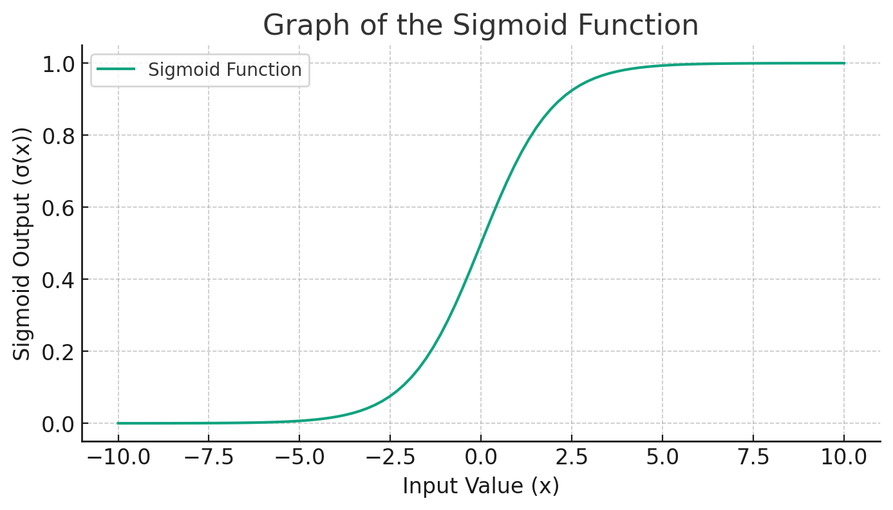
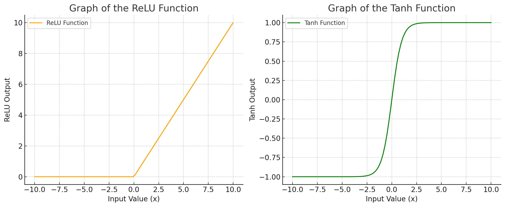

# Neural Networks, a Brief Overview

**Basic Components**

**Input Layer:** This is where the neural network receives its input data. For your example, the input could be features of an object (like size, shape, color intensity) that help to determine if it's red or blue.

**Weights:** These are parameters within the neural network that are adjusted during the training process. They determine the importance of each input in the final decision.

**Activation Functions:** These are functions applied to the weighted sum of inputs to introduce non-linear properties to the network. A common one often used in examples is the sigmoid function.

1 -
_Sigmoid Function:_ It's an activation function that maps any value to a value between 0 and 1. It's useful for binary classification (like red or blue). The sigmoid function is defined as:

    σ(x)=11+e−xσ(x)=1+e−x1​

2 -
_ReLU (Rectified Linear Unit):_ ReLU is a piecewise linear function that outputs the input directly if it is positive; otherwise, it outputs zero. It's very popular in deep neural networks because it helps to solve the vanishing gradient problem and allows for faster training. Commonly used in hidden layers of neural networks, especially in deep networks.

    f(x)=max⁡(0,x)f(x)=max(0,x)

3 -
_Tanh (Hyperbolic Tangent):_ Tanh is a rescaled version of the sigmoid function. Its output range is between -1 and 1 (instead of 0 and 1 as in the sigmoid), which can be advantageous in certain models as it centers the data, improving learning in the subsequent layers. Often used in hidden layers, especially in networks where centering data is beneficial.

        f(x)=tanh⁡(x)=21+e−2x−1f(x)=tanh(x)=1+e−2x2​−1

**Output Layer:** This gives the final decision or prediction of the neural network. For example, it could output a value between 0 and 1, where values close to 0 indicate "blue" and values close to 1 indicate "red".

# Example Graphs with the Activation Functions

_Graph of Sigmoid Function:_ The graph of a sigmoid function typically has an "S" shape. When the input to the sigmoid function is a large negative number, the output is close to 0. When the input is a large positive number, the output is close to 1.

To illustrate, imagine you have a neural network trained to classify objects as red or blue. You input features of an object into the network. The network, using its trained weights, processes these inputs through its layers and activation functions (like sigmoid). Finally, the output layer gives you a number. If this number is closer to 1, the network predicts "red"; if closer to 0, it predicts "blue".

Let's create a graph of the sigmoid function to illustrate how it maps input values to a range between 0 and 1. This graph helps visualize how intermediate values are handled by the sigmoid function, which is crucial in how a neural network makes decisions based on its inputs.

Here is the graph of the sigmoid function which has an "S" shape. The function smoothly transitions from near 0 to near 1.

- When the input value (x) is a large negative number, the output of the sigmoid function (σ(x)) is close to 0.
- When x is a large positive number, σ(x) is close to 1.
- For values of x around 0, σ(x) gives outputs that are in between, illustrating how the neural network deals with less clear-cut inputs.

In the context of the example for determining if an object is red or blue, inputs leading to a high positive value would result in an output close to 1 (indicating "red"), while inputs leading to a high negative value would result in an output close to 0 (indicating "blue"). Intermediate values would indicate a less certain decision.

This is a fundamental concept in neural networks, where the combination of weighted inputs and activation functions like sigmoid allows the network to make complex decisions based on the input data it receives.

The other activation functions of ReLU and Tanh graph as below:

# Neural Networks and Weights

Sigmoid example

    import numpy

    def NN(m1, m2, w1, w2, b):
    z = m1 + w1 \* m2 + w2 + b
    return sigmoid(z)

    def sigmoid(x):
    return 1/(1 + numpy.exp(-x))

To get random values to begin finding the weight and b values for training.

    w1 = numpy.random.randn()
    w2 = numpy.random.randn()
    b = numpy.random.randn()
