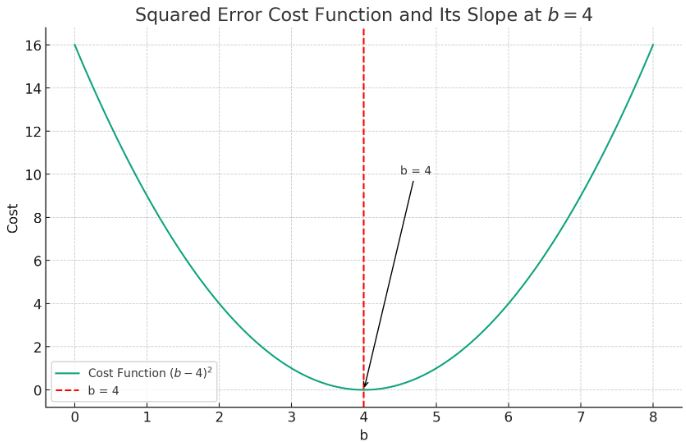

# Squared Error Cost Function

**Given a table of values such as the following for a table of circles:**

- color: red, blue, red, blue, red, blue, red, blue, ???
- length: 2, 2, 4, 3, 3.5, 2, 5.5, 1, 4.5
- width: 1.5, 1, 1.5, 1, .5, .5, 1, 1, 1

**If trying to find the ??? value using a NN the weights and constant values can be trainied or adjusted using a SQUARED ERROR COST VALE**

    import numpy

    def NN(m1, m2, w1, w2, b):
    z = m1 + w1 + m2 + w2 + b
    return sigmoid(z)

    def sigmoid(x):
    return 1/(1 + numpy.exp(-1))

    w1 = numpy.random.randn()
    w2 = numpy.random.randn()
    b = numpy.random.randn()

**To get the correct weights and constant for the w values and b value use a cost value, such as:**

    (prediction - target)^2

**This will identify where in a bellcurve the correct value is found on the intersection with the x axis line. To find the correct values the slope of the cost function is used.**

---

credit to:
[example credit to giant_neural_network](https://www.youtube.com/watch?v=c6NBkkKNZXw&list=PLxt59R_fWVzT9bDxA76AHm3ig0Gg9S3So&index=5)
