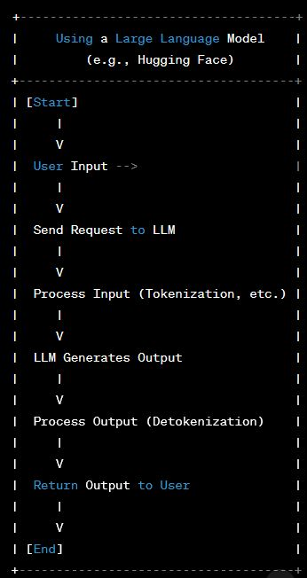

# LLMs

- LLMs can be impleneted in any language and are running behing the OPENAI APIs are Generative Pre-trained Transformers (GPTs)

- These models are a family of neural networks that uses a transformer architecture to make Inferences:

- Given some fragments of letters ect, the transformer deep learning architecture can compute or infer that other fragments would be probable to be found together with the ones provided as the input and works off pre-trained data.

- Alone the transformers would not give accurate data and the transformers need to be fine tuned and trained for the specific tasks.

- Training and tuning requires a tremendous amount of resources to gather and compute the needed information, this is why Open Source LLM models are so important like Llama.

- Running LLM with something like Huggingface or LLama

**LLama**

- Open Source Large Language Model Meta AI models are available to download for free for research purposes

- [LLama 2 by MetaAI](https://ai.meta.com/llama/)

- [Hugging face adpated version LLama2](https://huggingface.co/meta-llama/Llama-2-7b-chat-hf)

- LLama2 is often said to be comparable with chatgpt 3.5 in terms of performance
